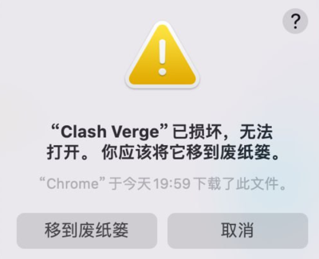

## 开发者无法验证或应用已损坏

> macOS 系统 10.12 版本后对来自非 Mac App Store 中的应用做了限制。



- 问题原因: 由于应用没有签名，所以可能会显示开发者无法验证或应用已损坏，需要授予开发者**Apple Developer Program** 会员资格。
- 解决方案:点击 `取消` 按钮，然后去 `设置` -> `隐私与安全性` 页面，点击 `仍要打开` 按钮，然后在弹出窗口里点击 `打开` 按钮即可。如果在 `隐私与安全性` 页面中找不到以上选项，或启动时提示文件损坏。打开终端，并执行下列命令进行授权。

```bash
sudo xattr -d com.apple.quarantine /Applications/Clash\ Verge.app
```
