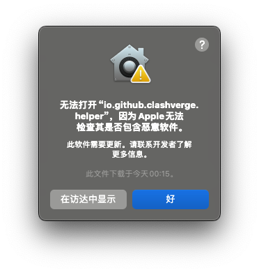

## 开发者无法验证或应用已损坏

> macOS 系统 10.12 版本后对来自非 Mac App Store 中的应用做了限制。


- 问题原因: 由于应用没有签名，所以可能会显示开发者无法验证或应用已损坏，需要授予开发者**Apple Developer Program** 会员资格。
- 解决方案: 点击 `取消` 按钮，然后去 `系统偏好设置` -> `安全性与隐私` 页面，点击 `仍要打开` 按钮，然后在弹出窗口里点击 `打开` 按钮即可。如果你的系统版本较高，可能在 `安全性与隐私` 页面中找不到以上选项，或启动时提示文件损坏。打开终端，并执行下列命令进行授权。

```bash
sudo xattr -d com.apple.quarantine /Applications/Clash\ Verge.app
```

## Apple 无法检查 App 是否包含恶意软件



- 解决方案: 详见[macOS 使用手册](https://support.apple.com/zh-cn/guide/mac-help/mchleab3a043/mac)，并选择对应 mac 版本的文档。

## macOS 系统代理设置修改失败/开关无效

> 点击系统代理开关启用/禁用系统代理，系统代理设置中实际上未能被修改。

- 问题原因: 更改锁定的系统偏好设置需要管理员密码，当前可能处于普通权限。
- 解决方案: `系统偏好设置` -> `安全性与隐私` -> `高级`，关闭 `访问系统范围偏好设置需要输入管理员密码` （不同系统版本的名称略有差异）。


## macOS 菜单栏左上角图标重叠


- 问题原因: macOS Sonoma 的系统 BUG。
- 解决方案: `系统偏好设置` -> `显示器`，调整一下显示器分辨率，然后再调回去。
