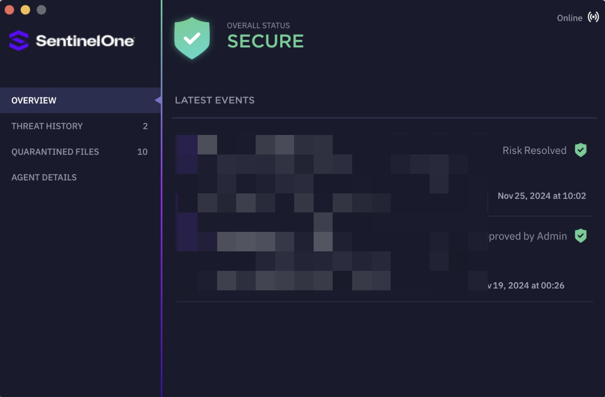
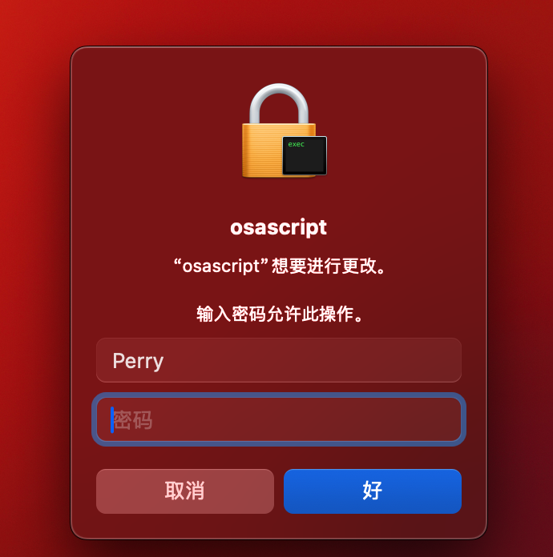
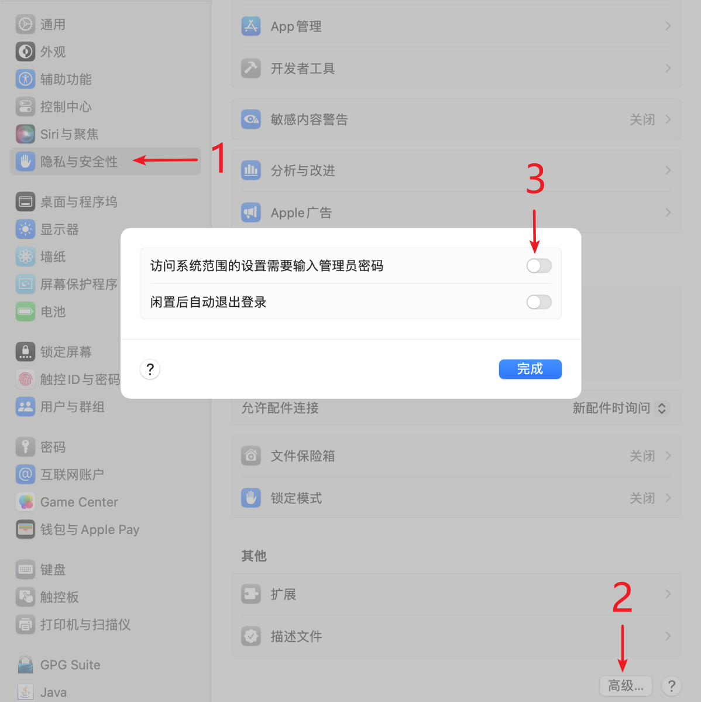

## 无法正常启动，闪退等

- 问题原因: 公司电脑安装有如下类似的安全软件，禁止软件安装服务

- 解决方案: 关闭安全软件或找管理员把 verge 加入白名单

## 每次重启登陆打开提示 “‘osascript’想要进行更改”

- 问题原因: Login Items 中的`won fen`启动项被禁用
- 解决方案: 系统设置中找到登录选项，打开`won fen`名称的服务启动项

## macOS 系统代理设置修改失败/开关无效

> 点击系统代理开关启用/禁用系统代理，系统代理设置中实际上未能被修改。

- 问题原因: 更改锁定的系统偏好设置需要管理员密码，当前可能处于普通权限。
- 解决方案: `系统偏好设置` -> `安全性与隐私` -> `高级`，关闭 `访问系统范围偏好设置需要输入管理员密码` （不同系统版本的名称略有差异），点击 `完成` 。

## macOS 菜单栏左上角图标重叠

- 问题原因: macOS Sonoma 的系统 BUG。
- 解决方案: `系统偏好设置` -> `显示器`，调整一下显示器分辨率，然后再调回去。

## 窗口消失无法通过任务栏 tray 点开

- 问题原因: 当接入其他显示器时，修改了 verge 的窗口位置，导致 verge 记忆了当前错误的恢复显示器位置。
- 解决方案: `系统偏好设置` -> `显示器`，调整一下显示器布局，或者暂时拔掉其他显示器，当 verge 窗口出现后，拖动到正确的显示器上。

## macOS 键入 option(alt) + 字母变成特殊字符，导致录入的快捷方式错误不能正常触发

- 问题原因: macOS 键盘的`option key printing special characters`特性导致，不同的键盘布局有不同的转换关系。
- 解决方案: `系统偏好设置` -> `键盘` -> `输入法` ，添加一种没有配置特殊字符的键盘布局。如何判断键盘布局有没有转换特殊字符？选中某个键盘布局，按下 option(alt)键并观察右侧下半区域**键盘图示上的字母是否发生变化**。挑选一种按下 option（alt）键后字母**变为键盘字母或空白**的键盘布局，如简体中文的`简体笔画`、`五笔型`。
