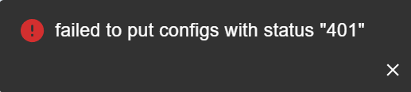
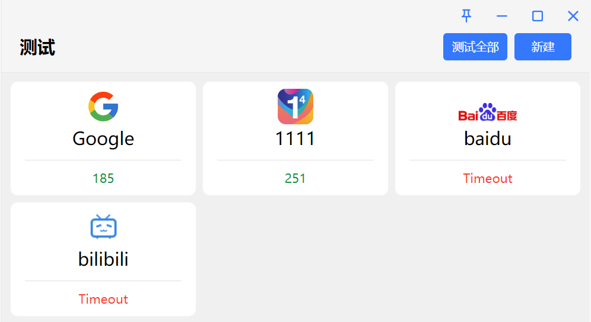

## TUN 模式无法开启

- Tun 模式需要管理员权限，请先安装并开启服务模式后再使用 Tun 模式。
- Mac/Linux 用户也可以在`设置`->`Clash 内核`,点击 ⚙️ 图标，点击"授权"。

## 找不到系统文件 os error

问题原因:

1. 内核文件损坏，没找到内核。
2. 内核文件被杀毒软件删除或添加到了隔离列表。

解决方案:

1. 如果文件损坏，删除老配置，卸载老版本，重新安装。
2. 如果被杀毒软件误伤，请将文件手动恢复并添加到白名单。

## 日志过大，占满磁盘

解决方案: 可以将日志等级设置为 `Silent` 或 `Error`，并在 `杂项设置` 中设置自动清理日志间隔。

## 导入订阅报错 401



解决方案: 卸载重装。

## 导入订阅报错 无效的证书

> error trying to connect: invalid peer certificate: UnknownIssuer


解决方案: 勾选 `允许无效证书（危险）`。

## proxy-providers 里的机场订阅中的 HY2 节点

配置文件添加（版本号不重要，含有 `clash-verge` 字样即可）。

```yaml
global-ua: clash-verge/v1.6.0
```

## 在命令行中使用代理

在设置页的**复制环境变量类型**选项中选择要使用的命令行类型（`PowerShell`，`Bash`，`CMD`），然后右键屏幕右下方系统托盘里的小图标，选择 `复制环境变量` 即可复制对应的命令行环境变量。然后在命令行中执行对应的命令即可使用代理。

## 无法访问公司内网域名

> 无法访问公司内网的域名，而 IP 可以正常访问。

- 问题原因: 配置中启用了内核的 `DNS` 模块，却未正确配置 DNS 服务器，导致无法解析内网的主机名/域名（由于内网主机名/域名不公开，即便根域名服务器也无法查到记录）。
- 解决办法: 修改配置文件，添加 `nameserver-policy`配置，为内网域名指定 DNS 服务器（一般为内网网关）。

假设你的 IP 为 `10.10.10.123` ，网关为 `10.10.10.1`，要访问的域名为 `www.helloworld.com`。

```yaml
dns:
  nameserver-policy:
    '+.helloworld.com': '10.10.10.1'
```

## GPU 异常占用高

- 问题原因: 暂时未知。
- 解决办法: `设置` -> `界面设置` -> 关闭 `流量图显`。

## 代理界面异常，不显示任何内容

> 代理界面一片空白，不显示任何节点信息，而代理运行正常。

日志提示: `External controller listen error: listen tcp 127.0.0.1:9097: bind: An attempt was made to access a socket in a way forbidden by its access permissions.`

- 问题原因: 外部控制端口被其他程序占用，或者外部控制访问密钥含有中文字符。
- 解决办法: `Clash设置` -> `外部控制` -> 修改 `外部控制监听地址` 中的端口并保存，然后退出并重启程序。

## Watt Toolkit（原名 Steam++）/ steamcommunity 302 冲突

> 使用 Watt Toolkit 或 steamcommunity 302 和 Clash Verge Rev 会导致无法访问被加速服务（如 Steam、Github 等），而 Clash For Windows 正常。

问题原因:

- `Watt Toolkit` / `steamcommunity 302` 默认是基于 `hosts` 文件工作的，通过修改系统 `hosts` 将被加速站点的请求劫持到本地的 `80` 或 `443`端口，由在此端口上监听的代理程序代为访问。
- `Clash For Windows` 使用的 `Premium` 内核并不会查询系统 `hosts` 文件。`Clash Verge Rev` 使用的 `Meta` 内核默认会查询系统 `hosts` 文件。
- 根据使用的**代理模式**、**分流规则**配置、**流量嗅探**配置的不同，会出现不同的情况：使用代理节点访问 `127.0.0.1`、使用代理节点访问 `加速服务器`，再访问被代理网站。
- 鉴于情况较为复杂，仅给出下列解决方案。**如不能解决，仅建议两者不要同时使用，不再列举所有情况的解决方案**。

解决办法: 禁用内核查询系统 `hosts` 的行为。

<!-- prettier-ignore -->
!!! info
    - 如果你的内核版本至少为`v1.18.2`，可以将系统变量 `DISABLE_SYSTEM_HOSTS` 设置为 `1` 。
    - 如果你的内核版本至少为`v1.18.5`（或最新 `alpha` 版本），可以使用下列方案。

- 如果你了解配置文件、`Merge`/`Srcipt`工作原理，只需按照你能够接受的方式，自行将** DNS 配置**中的[use-system-hosts](https://wiki.metacubex.one/config/dns/#use-system-hosts)修改为`false`即可。**下列方案均基于此原理**。
- 如果你的 Clash Verge Rev 版本为 `v1.6.2`及以上。在订阅页面新建一个 Merge 配置，文件使用以下内容保存并右键`启用`。

```yaml
dns:
  use-system-hosts: false
```

- 如果你的 Clash Verge Rev 版本为 `v1.6.2`以下。在订阅页面新建一个 Script 配置，文件使用以下内容保存并右键`启用`。

```javascript
function main(config) {
  config.dns = { ...config.dns, "use-system-hosts": false };
  return config;
}
```

## 代理右上角小图钉 📌 怎么取消

<!-- prettier-ignore -->
!!! tip
    - 📌为**红色**表示锁定当前节点，且**当前节点为可用**（自动选择优先选择该节点，尽管延迟不是最小的）。
    - 📌为**灰色**表示锁定当前节点，但**当前节点不可用**（下次健康检查变为可用时，继续优先使用该节点）。
    - 当需要为 `url-test` 类型的代理组设置一个更高优先级的节点，可以使用该方法。
    - `fallback` 类型的代理组会在发生故障转移时自动消除。

解决办法: 主动点击 :fontawesome-solid-wifi: 按钮，并等待代理组内节点全部测试完成。

<video controls>
  <source src="../assets/faq/other/fixed.webm">
</video>

## 测试界面异常超时

> 测试界面进行测试时，国外网站延迟测试正常，但是国内网站延迟测试（直连）立马提示超时，实际上网站均可以正常访问。



- 可能原因: 杀毒软件（如火绒）对 HTTPS 连接进行加密，出现证书不一致的情况报错导致。可能还会伴随着实际体验延迟较大的情况。

- 解决办法: 关闭杀毒软件（如火绒） Web 扫描加密功能（各厂商功能名称可能有差异），或将使用的 `二进制内核文件` 添加到信任程序名单中，并重启程序。
