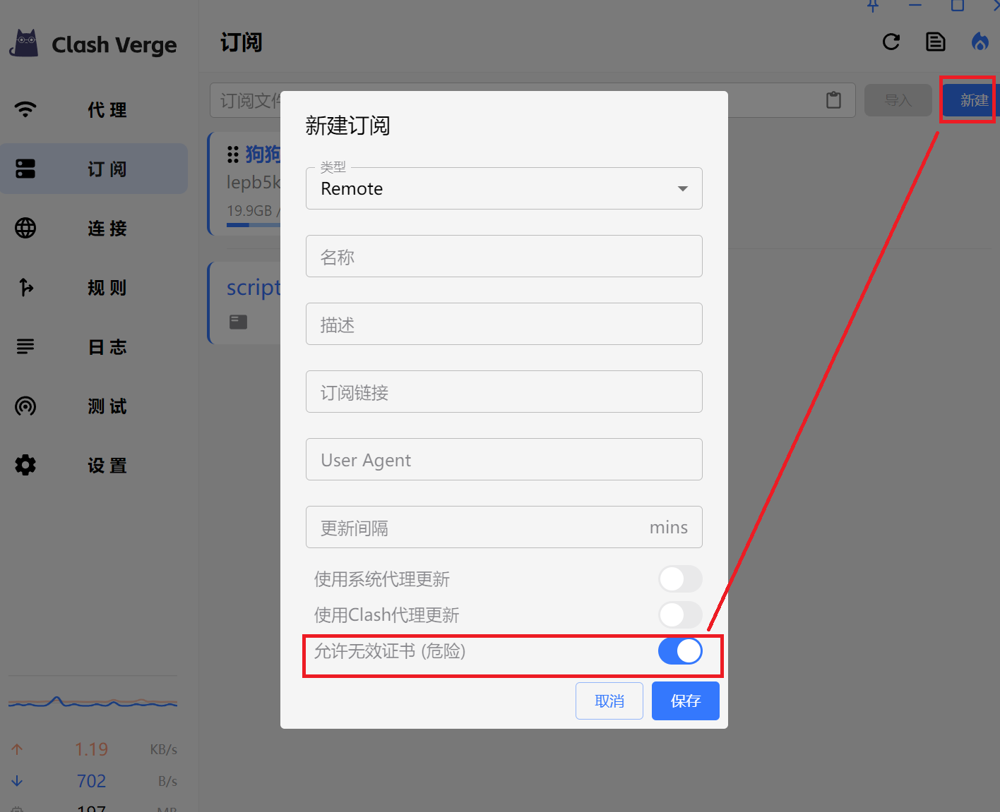

## 导入订阅报错 401


解决方案: 卸载重装。

## 导入订阅报错 无效的证书

> error trying to connect: invalid peer certificate: UnknownIssuer



解决方案: 勾选 `允许无效证书（危险）`。

## Windows 无法选中订阅

> 日志报错: An attempt was made to access a socket in a way forbidden by its access permissions.

系统服务没有开启，执行下列命令开启服务。

```
net stop hns
net start hns
```

或者手动打开服务设置，重新启动 `Hot Network Service`。


## 安装新版本后之前的配置、订阅不见了

从 `1.4.3` 版本开始，我们修改了配置文件路径，建议删除老版本再安装。
你可以在`设置`->`应用目录`，找到配置文件路径。
