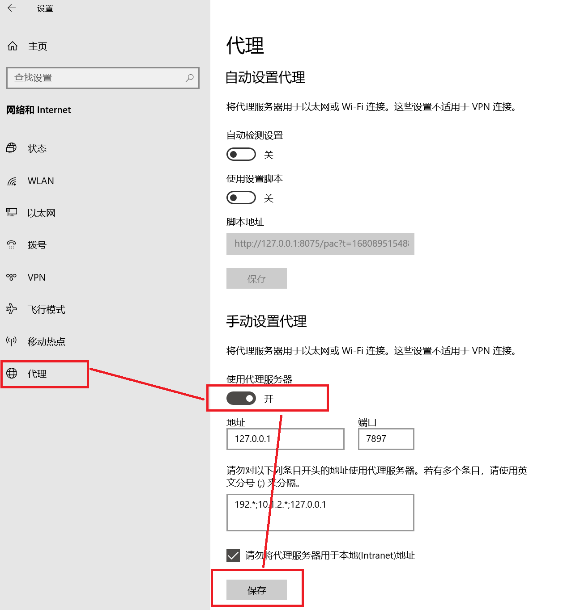
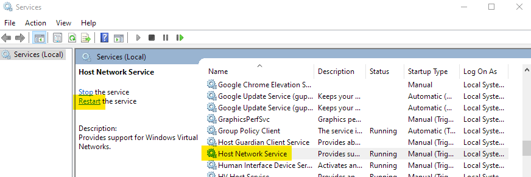
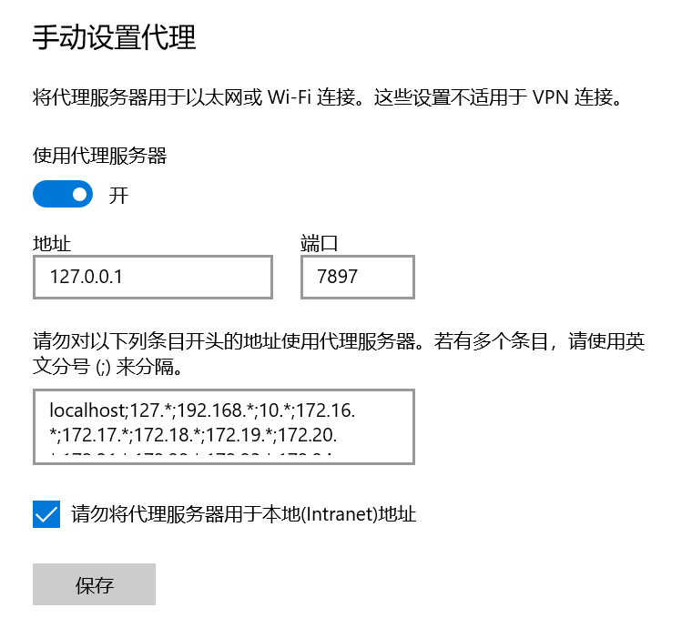
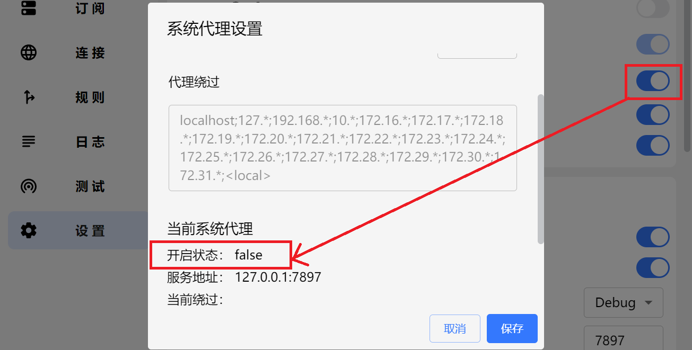
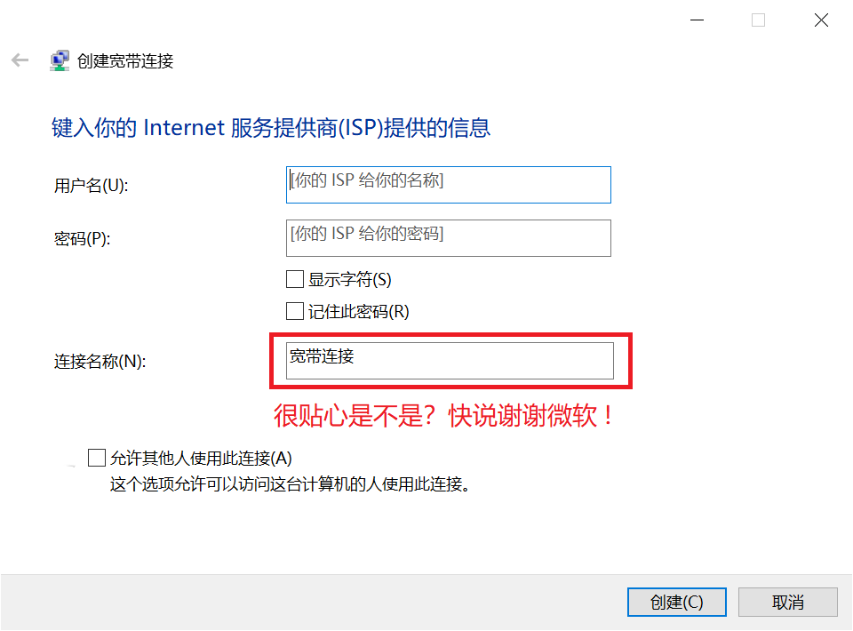

## 代理菜单空白

问题原因

- 内核通信失败

解决方案

- 打开 Windows 防火墙设置，全部关闭，再开启

## 打开TUN模式后网络异常

问题原因

- 系统中可能有多个网卡 / 网段与配置中的规则冲突

解决方案

- 打开网络设置，删除多余网卡，参见[Issue#2400](https://github.com/clash-verge-rev/clash-verge-rev/issues/2400)

## 此应用无法在你的电脑上运行


99.99% 是因为你下载错了文件，请检查你是否下载了对应你机器架构的安装包。

对于大部分人来说，应该下载 `x64` 版本，而不是 `arm64` 版本。

## 无法启动/不显示界面/闪退/只有托盘图标

问题原因

- Tauri 框架依赖于 `WebView2`。如果卸载或禁用了 `WebView2` ,将无法显示界面。具体表现为: 程序可以启动，但是点击托盘菜单没有反应。

解决方案

- 如果是利用第三方软件禁用了 `Edge`，请检查是否同时禁用了 `WebView2`，将 `WebView2` 取消禁用。
- 如果是卸载了 `WebView2`，可以[下载 WebView2 安装包](https://developer.microsoft.com/zh-cn/microsoft-edge/webview2/#download)，重新安装 WebView2。
- 如果是已安装 `WebView2` 但仍无法打开面板，请尝试在 [Release](https://github.com/clash-verge-rev/clash-verge-rev/releases/latest) 下载内置了 `WebView2` 的版本（带有 `fixed_webview2` 字样的安装包）。

## 闪退

问题原因

- 安装有**360、金山毒霸**等杀毒软件拦截[服务模式](../guide/term.md#_2)安装。

解决方案

- 不要使用**中国的杀毒软件**。

## WebView2 无法正常安装

问题原因

- 可能是你的 Windows 系统关闭了自动更新。

解决方案

- 打开自动更新。

- 若实在无法安装 WebView2，可以尝试在 [Release](https://github.com/clash-verge-rev/clash-verge-rev/releases/latest) 下载内置了 `WebView2` 的版本（带有 `fixed_webview2` 字样的安装包）。

## Windows 7 无法使用

- 已不再支持 `Windows7`


## 静默启动失效

> 配置了静默启动，依然弹出程序窗口。

- 如果出现任务管理器中有**两个启动项**，或者开机启动时静默启动失效。请用**管理员权限**启动软件后**开关一次**开机启动设置，即可删除多余的启动项。
- 如果平时一直是使用管理员权限运行的软件，那就用**普通用户权限**运行软件后**开关一次**开机启动设置，删除多余启动项后，后续不会再出现这个问题。

## 自启动失效

- 原因：每次安装的时候会把之前的(旧的)启动项清除掉。
- 办法：重新再开关一次开机启动的开关就行了。

> 这样设计的理由：
> 
> 1.老版本的应用名称和最新版有点区别（老版本叫clash verge，新版本多一个dash: clash-verge）如果不清理启动项，就会导致某些报错。
> 
> 2.有些用户安装路径混乱，会产生启动多个进程的情况，导致程序异常

## 不打开 Clash 无法使用网络

> 不使用 Clash 就无法访问网络，打开 Clash 后才能正常访问网络。

- 可能原因: 由于未知原因（如断电、蓝屏或其他原因），系统代理未能正确地被关闭（即使 Clash 已退出），但实际上 Windows 的系统代理设置开关仍然开着。
- 解决办法: 打开 `Windows 设置` -> `网络和 Internet` -> `代理` -> `手动设置代理`，关闭 `使用代理服务器`。



## 无法选中订阅

> 日志报错: An attempt was made to access a socket in a way forbidden by its access permissions.

系统服务没有开启，执行下列命令开启服务。

```
net stop hns
net start hns
```

或者手动打开服务设置，重新启动 `Host Network Service`。


## 应用内更新后自动安装到了 C 盘默认目录/应用内更新后仍然是旧版本

问题原因

- 之前的某些版本升级有 Break Change，如果从很旧的版本升级会导致无法识别已安装目录。

解决方案

- 手动卸载系统中存在的多个 Clash Verge Rev，然后重新安装最新版本，后续更新不会出现此类问题。

## Windows 系统 UWP 应用(如微软商店等)无法使用代理

问题原因

- Windows 系统 UWP 应用存在沙盒机制，正常情况下无法访问 localhost（即无法访问回环地址），而代理程序在本地端口监听请求。因此需要解除 UWP 应用的回环访问限制。

解决方案

- 打开 `Clash 设置` -> `UWP 工具` ，找到需要解除限制的 UWP 程序。
- 勾选需要解除限制的 UWP 程序后，点击工具顶部的 `Save Changes` 按钮保存修改。

## 修改PowerShell脚本变量的主机地址

问题描述

- 此前PWSH脚本变量的地址固定为`127.0.0.1`，不便在其它主机上使用(如WSL)。

解决方案

- 打开`Windows环境变量`->新建用户变量`CLASH_VERGE_REV_IP`，值填写为你想要的IP地址。重新启动`CVR`后复制PWSH变量即可生效。

## Windows 宽带拨号无法使用系统代理（2.0 版以后无此问题）

> Windows 的 `Windows 设置` -> `网络和 Internet` -> `代理` 中显示系统代理已经开启，且指向了正确的端口。Clash Verge Rev 的 `设置` -> `系统代理` 小齿轮界面中，当前系统代理的开启状态却显示为未启用。

|  |  |
| ------------------------------------------------------------------ | ----------------------------------------------------------------------- |

解决办法

- 下载安装最新版本。或：
- 打开注册表`HKEY_CURRENT_USER\Software\Microsoft\Windows\CurrentVersion\Internet Settings\Connections`删除乱码名称的条目([引用博客](https://myth.cx/p/windows-proxy/))。
- **删除**原有的宽带拨号设置，然后**重新创建**宽带拨号设置（<font color="red">连接名称不要使用中文</font>）。



## 版本更新后图标没有变化/老版图标/图标白色方块

- 问题原因: Windows 需要更新图标缓存文件，并重启资源管理器。

- 解决办法: 点击按钮复制下列代码，`Win + R` 输入 `cmd` 确定，右键粘贴命令并执行。或手动删除用户目录下的该文件，并重启资源管理器。

```bash
del /A "%userprofile%\AppData\Local\IconCache.db" 2>nul & taskkill /f /im explorer.exe & start explorer.exe
```

## 找不到 VCRUNTIMEXXX.dll，无法继续执行代码（2.0版本后安装器会自动检测并安装vc runtime）

- 问题原因：操作系统缺少 VC 运行环境所需的库。
- 解决方案：下载并安装 VC 运行库。

=== "x64"

    | 运行库 | 下载地址 |
    | ----- | ------- |
    | `vc_redist.x64.exe` | [vc_redist.x64.exe](https://aka.ms/vs/17/release/vc_redist.x64.exe) |

=== "x86"

    | 运行库 | 下载地址 |
    | ----- | ------- |
    | `vc_redist.x86.exe` | [vc_redist.x86.exe](https://aka.ms/vs/17/release/vc_redist.x86.exe) |

=== "arm64"

    | 运行库 | 下载地址 |
    | ----- | ------- |
    | `vc_redist.arm64.exe` | [vc_redist.arm64.exe](https://aka.ms/vs/17/release/vc_redist.arm64.exe) |

## Windows 系统开启代理后无法使用 Phone Link 连接手机

### http 系统代理用户

点击系统代理旁的设置按钮，在当前绕过后添加 `;dcg.microsoft.com`

### 虚拟网卡用户

在规则中添加 dcg.microsoft.com 直连规则

## 验证进程异常退出，退出码: -1073741819

- 问题原因：目前 CVR [内置](https://github.com/clash-verge-rev/clash-verge-rev/blob/97133433233f28928f1eb7c2e17e62603c68c59b/scripts/prebuild.mjs#L193)的 mihomo 是 v2 指令集，特别老的 CPU 可能不支持。

- 解决办法：可以[下载](https://wiki.metacubex.one/startup/) mihomo 的 v1 指令集版本手动替换。

<a id="service-core-permissions"></a>

## 服务内核未通过安全检查，已切换到普通模式（Sidecar）

### 为什么会出现

服务模式会以系统权限启动内核。如果普通账户也能修改内核文件，或替换安装目录及其上级目录里的文件，其他程序就可能借此获得系统权限。因此，服务会检查内核文件和各级目录的所有者与访问权限，不符合要求时拒绝启动。

出现此提示后，应用已切换到普通模式（Sidecar）；以普通用户权限运行时无法使用 TUN。可以选择以下管理员运行方式，或修复权限后恢复服务模式。

### 不想或不会修复：以管理员身份运行

**可以不安装服务，直接以管理员身份运行 Clash Verge Rev。** 这种方式也可以使用 TUN，适合暂时不想修复或不熟悉权限设置的用户。

1. 在托盘图标菜单中退出 Clash Verge Rev，确保已完全退出，而不只是关闭窗口。
2. 右键单击 Clash Verge Rev 快捷方式或 `clash-verge.exe`，选择「以管理员身份运行」，在 Windows 授权提示中允许。
3. 无需安装服务；若出现服务安装或修复提示，选择「继续使用 Sidecar」。进入应用后，按需重新开启 TUN。

以后使用此方式时，也需要以管理员身份启动软件。管理员运行不会修复原来的目录权限；如果日后希望使用服务模式，再按下文处理。

### 修复权限并恢复服务模式

弹窗显示的是简化后的中文说明，不会直接显示 `core path` 等技术信息。**以下提到的英文报错和具体路径，需要先右键单击弹窗通知，复制原始报错后查看。**

1. **复制并查看具体路径。** 在应用内右键单击这条通知，然后打开记事本，按 `Ctrl+V` 粘贴。通知会保留到手动关闭。在**粘贴出的原始报错**中，找到 `core path`，它后面的路径就是未通过检查的文件或目录；`verge-mihomo.exe` 和 `verge-mihomo-alpha.exe` 可能因为同一个上级目录而同时被拒绝。
2. **如果安装在下载目录、桌面、用户目录或自行解压的目录中：** 先在「设置 → Verge 高级设置 → 备份设置」中备份配置，退出应用，再使用[官方安装包](../install.md)安装到默认的 `C:\Program Files\Clash Verge` 目录。避免给普通账户授予该目录的「修改」或「完全控制」权限，也不要把旧目录的自定义权限复制过去。
3. **如果已经安装在默认目录，或重新安装后仍提示：** 根据第 1 步复制出的路径，在资源管理器中找到对应的文件或文件夹，右键单击它，打开「属性 → 安全 → 高级」，检查所有者和权限条目。内核文件及各级目录的所有者应为 `SYSTEM`、`Administrators` 或 `TrustedInstaller`。普通账户不应具有修改内核、替换目录、删除目录内文件或更改权限的权限。若权限来自继承，应检查对应的上级目录；不熟悉 Windows 权限设置时，请让系统管理员协助恢复该路径的正常权限。
4. **修复后恢复服务模式。** 启动新安装位置中的 Clash Verge Rev，在「设置 → 服务模式」重新安装服务，按提示允许管理员授权；必要时先卸载服务再安装。确认首页显示「服务模式」，再重新开启 TUN。

### 复制出的原始报错指向 C:\ 时

如果第 1 步粘贴出的内容包含 `core path "\\?\C:\" is writable by an account other than SYSTEM, Administrators or TrustedInstaller`，表示检查未通过的位置是 **C 盘根目录**，不代表应用一定安装在根目录。`\\?\` 是 Windows 路径前缀。

服务会一直检查到磁盘根目录，因此只修改安装文件夹，或反复重装服务，可能无法解决。请让系统管理员在「此电脑 → 本地磁盘 (C:) → 属性 → 安全 → 高级」检查允许普通账户删除子项、更改权限或完全控制等权限条目，并结合系统原有设置修复。

!!! warning
    不要对整个 C 盘递归执行权限重置、接管所有权或删除用户组权限。不要勾选「使用可从此对象继承的权限项目替换所有子对象的权限项目」。这些操作可能破坏 Windows 和其他应用的权限。普通账户正常的读取权限，以及仅允许在根目录创建文件夹的权限，不必一并删除。

### 仍然无法恢复

如果复制出的原始报错提到所有者（`is owned by`）、无法读取权限或其他安全检查原因，请保留完整内容，不要一律按「普通账户可写」处理。提供报错路径、安装位置和[导出的日志](../guide/log.md)，便于进一步排查。
