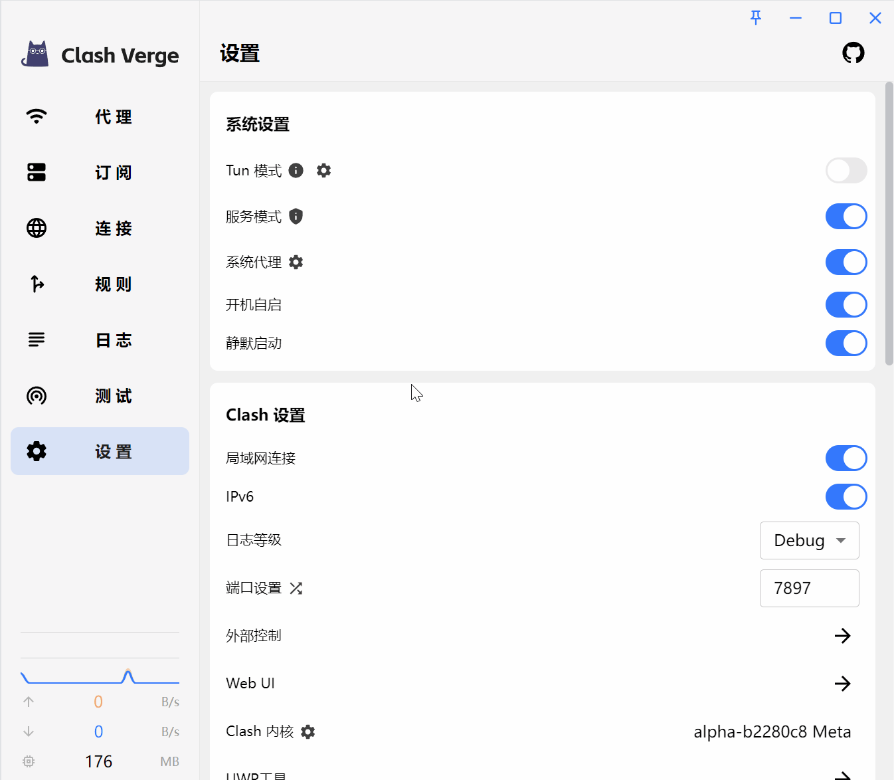

> 代理绕过一般有以下方式: 系统代理绕过、TUN 流量排除、自定义路由规则。

## 系统代理绕过

> 如果你使用的是系统代理, 你可以通过设置代理绕过配置来决定哪些请求不使用系统代理。

示例: 计划将发往 `10.1.2.*` 的请求绕过系统代理（本机环回地址和局域网也无需代理）



## TUN 流量排除

> 如果你使用的是 TUN 模式, 你可以通过设置 TUN 流量排除配置来决定哪些不被 TUN 模式路由。

TUN 配置请参考 [TUN 配置文档](https://wiki.metacubex.one/config/inbound/tun)

## 自定义路由规则

> 自定义路由规则，决定请求流量如何被路由。

示例:

- 让 `10.11.12.0/24` 网段走直连
- 让 `baidu.com` 结尾的域名走指定流量出口

```yaml
rules:
  - IP-CIDR,10.11.12.0/24,DIRECT,no-resolve
  - DOMAIN-SUFFIX,baidu.com,流量出口名称
```

规则配置请参考 [规则配置文档](https://wiki.metacubex.one/config/rules/)
