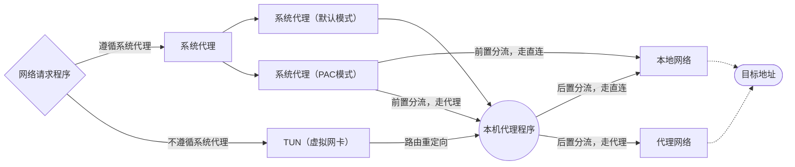

> 配置规则的主要目的是为了将流量进行分流，以达到直连加快访问、节省机场流量、强制使用代理等目的。可大致将分流归为两类：前置分流、后置分流。

> 前置分流：请求还未发出，决定请求流量是否流向本机的代理程序。

> 后置分流：请求流量已经抵达了本机的代理程序，决定这部分流量应该流向哪里。

> 流量流向大致如下图所示，请根据自身情况，选择适合自己的分流方式（阶段）、编写恰当的分流规则。

## 前置分流

> 前置分流的作用范围主要是系统代理，这要求进行网络请求的程序**必须遵循系统代理**（如浏览器请求、各种 IDE 程序内置代理配置）。

<!-- prettier-ignore -->
!!! tip
    该分流方式的适用面较窄，通常用于简单场景。

假设：

1. 程序启用了 `系统代理` 模式，并在本地的 `127.0.0.1:7897` 监听。
2. 经过考量后，决定将 `www.example.com` 的流量不要经过代理程序，直接本地网络出去。

### 方法一：系统代理 PAC 模式

> 系统代理有两种工作模式：默认模式、PAC 模式。其中，PAC 模式会在本地启动一个 http 文件服务，用于提供一个 javascript 脚本文件。浏览器会访问该服务，下载并解析这份按照规定格式编写的脚本代码，便明白了流量应该流向哪里。

1. 启用 PAC 模式。

2. 编写 PAC 脚本。

有待完善

### 方法二：浏览器插件

有待完善

## 后置分流

> 后置分流说明请求流量已经抵达了本地代理程序，通过配置代理程序的分流规则，决定流量流向哪里。

<!-- prettier-ignore -->
!!! warning
    代理程序分流要求内核运行在 `规则模式`，不同模式的区别详见[规则/ 全局 / 直连模式](./term.md#_1)。

### 入门：分流规则

> 订阅文件提供的分流配置有时并不完全满足自己的需求。这时可以自行配置分流规则。

有待完善

### 进阶一：内置规则集（GEOSITE、GEOIP）

> 一条条按照域名添加效率并不高。这时可以使用内核内置的域名/站点数据，批量进行配置。

有待完善

### 进阶二：外部规则集（rule-providers）

> 一个人的力量终究是有限的，编写的规则也可能并不完备。这时可以使用别人已经维护好的规则集，省时又省力。

有待完善
