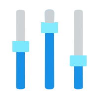
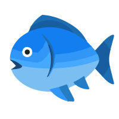

## 图标配置

需要配置代理组的 [icon](https://wiki.metacubex.one/config/proxy-groups/#icon) 字段。

```yaml
proxy-groups:
- name: 谷歌服务
  type: select
  interval: 300
  timeout: 3000
  url: https://www.google.com/generate_204
  lazy: true
  proxies: [省略]
  icon: https://fastly.jsdelivr.net/gh/clash-verge-rev/clash-verge-rev.github.io@main/docs/assets/icons/google.svg
```

### 支持类型

<!-- prettier-ignore -->
!!! tip
    - [附录](#_4)有图标集(彩色、亮色、暗色)、常见 `SVG` 图标。
    - 右键图片可以选择 `复制图片地址` 。

> 支持 `url图片地址` 、`Base64 编码字符串`、`svg文件内容` 三种类型。

- 使用 url 指定图片地址（支持常见图片格式，例如: `png`、`jpeg`、`gif` 以及 `svg`）。

```yaml
icon: https://fastly.jsdelivr.net/gh/clash-verge-rev/clash-verge-rev.github.io@main/docs/assets/icons/google.svg
```

- 使用 Base64 编码后的图片。[图片转 Base64 编码](https://www.jyshare.com/front-end/59/)。

```yaml
icon: data:image/svg+xml;base64,PHN2ZyB4bWxucz0iaHR0cDovL3d3dy53My5vcmcvMjAwMC9zdmciIHZpZXdCb3g9IjAgMCA0OCA0OCIgd2lkdGg9IjQ4cHgiIGhlaWdodD0iNDhweCI+DQogICAgPHBhdGggZmlsbD0iI2ZiYzAyZCINCiAgICAgICAgZD0iTTQzLjYxMSwyMC4wODNINDJWMjBIMjR2OGgxMS4zMDNjLTEuNjQ5LDQuNjU3LTYuMDgsOC0xMS4zMDMsOGMtNi42MjcsMC0xMi01LjM3My0xMi0xMglzNS4zNzMtMTIsMTItMTJjMy4wNTksMCw1Ljg0MiwxLjE1NCw3Ljk2MSwzLjAzOWw1LjY1Ny01LjY1N0MzNC4wNDYsNi4wNTMsMjkuMjY4LDQsMjQsNEMxMi45NTUsNCw0LDEyLjk1NSw0LDI0czguOTU1LDIwLDIwLDIwCXMyMC04Ljk1NSwyMC0yMEM0NCwyMi42NTksNDMuODYyLDIxLjM1LDQzLjYxMSwyMC4wODN6IiAvPg0KICAgIDxwYXRoIGZpbGw9IiNlNTM5MzUiDQogICAgICAgIGQ9Ik02LjMwNiwxNC42OTFsNi41NzEsNC44MTlDMTQuNjU1LDE1LjEwOCwxOC45NjEsMTIsMjQsMTJjMy4wNTksMCw1Ljg0MiwxLjE1NCw3Ljk2MSwzLjAzOQlsNS42NTctNS42NTdDMzQuMDQ2LDYuMDUzLDI5LjI2OCw0LDI0LDRDMTYuMzE4LDQsOS42NTYsOC4zMzcsNi4zMDYsMTQuNjkxeiIgLz4NCiAgICA8cGF0aCBmaWxsPSIjNGNhZjUwIg0KICAgICAgICBkPSJNMjQsNDRjNS4xNjYsMCw5Ljg2LTEuOTc3LDEzLjQwOS01LjE5MmwtNi4xOS01LjIzOEMyOS4yMTEsMzUuMDkxLDI2LjcxNSwzNiwyNCwzNgljLTUuMjAyLDAtOS42MTktMy4zMTctMTEuMjgzLTcuOTQ2bC02LjUyMiw1LjAyNUM5LjUwNSwzOS41NTYsMTYuMjI3LDQ0LDI0LDQ0eiIgLz4NCiAgICA8cGF0aCBmaWxsPSIjMTU2NWMwIg0KICAgICAgICBkPSJNNDMuNjExLDIwLjA4M0w0My41OTUsMjBMNDIsMjBIMjR2OGgxMS4zMDNjLTAuNzkyLDIuMjM3LTIuMjMxLDQuMTY2LTQuMDg3LDUuNTcxCWMwLjAwMS0wLjAwMSwwLjAwMi0wLjAwMSwwLjAwMy0wLjAwMmw2LjE5LDUuMjM4QzM2Ljk3MSwzOS4yMDUsNDQsMzQsNDQsMjRDNDQsMjIuNjU5LDQzLjg2MiwyMS4zNSw0My42MTEsMjAuMDgzeiIgLz4NCjwvc3ZnPg==
```

- 使用 `svg` 文件的内容（需要对引号进行转义）。

```yaml
icon: "<svg xmlns=\"http://www.w3.org/2000/svg\" viewBox=\"0 0 48 48\" width=\"48px\" height=\"48px\"><path fill=\"#fbc02d\"
        d=\"M43.611,20.083H42V20H24v8h11.303c-1.649,4.657-6.08,8-11.303,8c-6.627,0-12-5.373-12-12	s5.373-12,12-12c3.059,0,5.842,1.154,7.961,3.039l5.657-5.657C34.046,6.053,29.268,4,24,4C12.955,4,4,12.955,4,24s8.955,20,20,20	s20-8.955,20-20C44,22.659,43.862,21.35,43.611,20.083z\" /><path fill=\"#e53935\"
        d=\"M6.306,14.691l6.571,4.819C14.655,15.108,18.961,12,24,12c3.059,0,5.842,1.154,7.961,3.039	l5.657-5.657C34.046,6.053,29.268,4,24,4C16.318,4,9.656,8.337,6.306,14.691z\" /><path fill=\"#4caf50\"
        d=\"M24,44c5.166,0,9.86-1.977,13.409-5.192l-6.19-5.238C29.211,35.091,26.715,36,24,36	c-5.202,0-9.619-3.317-11.283-7.946l-6.522,5.025C9.505,39.556,16.227,44,24,44z\" /><path fill=\"#1565c0\"
        d=\"M43.611,20.083L43.595,20L42,20H24v8h11.303c-0.792,2.237-2.231,4.166-4.087,5.571	c0.001-0.001,0.002-0.001,0.003-0.002l6.19,5.238C36.971,39.205,44,34,44,24C44,22.659,43.862,21.35,43.611,20.083z\" /></svg>"
```

### 图标缓存

> 程序会对下载的 icon 进行缓存。

缓存的目录为`应用目录`\icons\cache 。

## 附录

### 图标集

> 网络上较为流行的图标集。

<!-- prettier-ignore -->
!!! tip
    Clash Verge 的代理组图标大小为 **`32 * 32`** 像素，并会为图标添加**圆角样式**。

| 图标集                                      | 仓库地址                                                                                                                                               | 图标格式 | 图标集信息           | 图标预览                                                                                                                                                                                                                                                                                                                                                                                                       |
| ------------------------------------------- | ------------------------------------------------------------------------------------------------------------------------------------------------------ | -------- | -------------------- | -------------------------------------------------------------------------------------------------------------------------------------------------------------------------------------------------------------------------------------------------------------------------------------------------------------------------------------------------------------------------------------------------------------- |
| [Qure](./icon_sets/Qure.md)                 | <a href="https://github.com/Koolson/Qure" target="_blank"></a>                             | `png`    | 彩色、亮色、暗色图标 |                                                                                      |
| [mini](./icon_sets/mini.md)                 | <a href="https://github.com/Orz-3/mini" target="_blank"></a>                                 | `png`    | 彩色、暗色图标       |                                                                                                                                             |
| [flag-icons](./icon_sets/flag-icons.md)     | <a href="https://github.com/lipis/flag-icons" target="_blank"></a>                     | `svg`    | 标准 3:2 国旗图标    |    |
| [WHATSINStash](./icon_sets/WHATSINStash.md) | <a href="https://github.com/shindgewongxj/WHATSINStash" target="_blank"></a> | `png`    | 彩色图标             |                                                                                     |

### 常见图标

> 一些常见 `SVG` 图标。

|                                                                              |                                                                                  |                                                                             |                                                                                  |                                                                                 |                                                                                  |
| ---------------------------------------------------------------------------- | -------------------------------------------------------------------------------- | --------------------------------------------------------------------------- | -------------------------------------------------------------------------------- | ------------------------------------------------------------------------------- | -------------------------------------------------------------------------------- |
| <div>节点选择</div>     | <div>延迟选优</div>          | <div>故障转移</div> | <div>负载均衡(散列)</div> | <div>负载均衡(轮询)</div> | <div>全局直连</div>           |
| <div>全局拦截</div>      | <div>广告过滤</div>            | <div>应用净化</div>     | <div>Cloudflare</div>   | <div>WARP</div>              | <div>漏网之鱼</div>           |
| <div>Microsoft</div> | <div>Linux</div>             | <div>MacOS</div>        | <div>Andriod</div>         | <div>Apple</div>            | <div>Google Play</div> |
| <div>Google</div>       | <div>Youtube</div>         | <div>Telegram</div>  | <div>Twitter</div>         | <div>Instagram</div>    | <div>Facebook</div>       |
| <div>Netflix</div>     | <div>Disney Plus</div> | <div>Tiktok</div>      | <div>ChatGPT</div>         | <div>Claude</div>          | <div>Bing</div>               |
| <div>Discord</div>     | <div>Reddit</div>           | <div>WhatsApp</div>  | <div>OneDrive</div>       | <div>Github</div>          | <div>Amazon</div>           |
| <div>Steam</div>         | <div>Epic</div>               | <div>XBox</div>          |                                                                                  |                                                                                 |                                                                                  |
