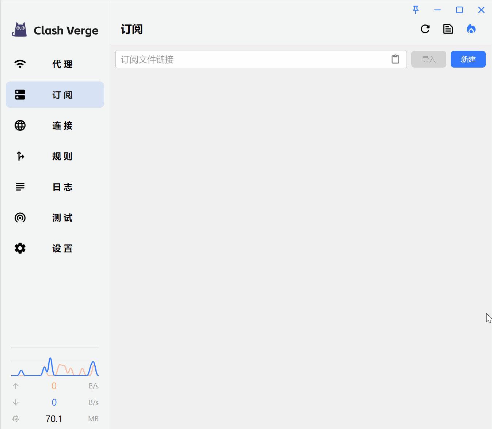
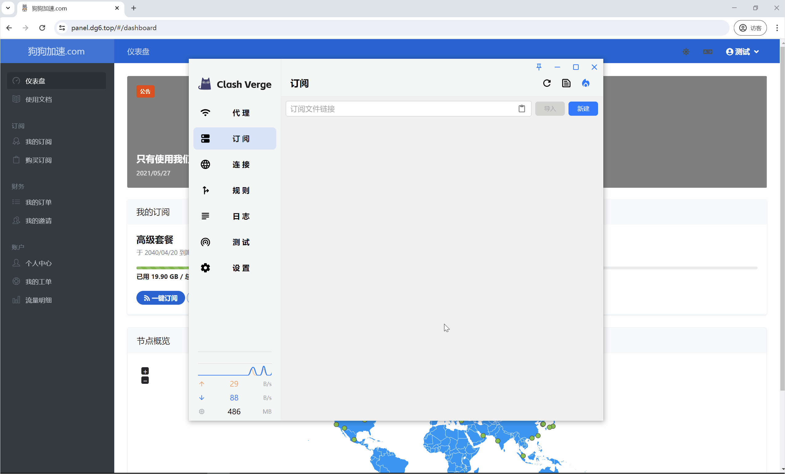
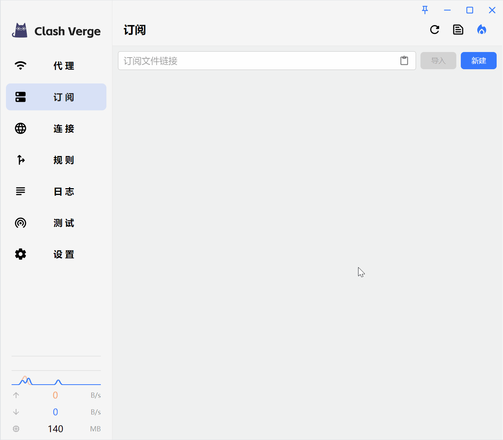

## 远程订阅

> 远程订阅支持三种方式导入: 订阅链接导入、订阅链接配置、URL Schemes

### 订阅链接导入

<!-- prettier-ignore -->
!!! info
    如果通过`订阅链接导入`的方式提示 `client error(Connect)`，请尝试其他导入方式。


### 订阅链接配置

<!-- prettier-ignore -->
!!! warning
    如果通过`订阅链接配置`的方式仍然提示 `client error(Connect)`，请尝试勾选 `允许无效证书（危险）`，并保存重试。



### URL Schemes



该方式等价于访问如下地址。

```
clash://install-config?url=<URI编码后链接>
```

如果无法正常使用该功能，可能是由于使用其他 Clash 代理软件（如 CFW）卸载不完全。请检查下列注册表项指向的 exe 路径是否正确。

```
HKEY_CLASSES_ROOT\clash\shell\open\command
```

或者将下列配置保存为 `.reg` 文件，手动将配置添加进注册表（以管理员身份运行）。便携版请自行修改配置中的路径。

```
Windows Registry Editor Version 5.00

[HKEY_CLASSES_ROOT\clash]
"URL Protocol"=""
@="URL:clash"

[HKEY_CLASSES_ROOT\clash\DefaultIcon]
@="C:\\Program Files\\Clash Verge\\Clash Verge.exe"

[HKEY_CLASSES_ROOT\clash\shell]

[HKEY_CLASSES_ROOT\clash\shell\open]

[HKEY_CLASSES_ROOT\clash\shell\open\command]
@="\"C:\\Program Files\\Clash Verge\\Clash Verge.exe\" \"%1\""

```

## 本地配置



本地配置如无特殊需求，一般无需配置更新间隔。

<!-- prettier-ignore -->
!!! info
    选择文件不是必须的，直接保存会生成一份空配置文件。
    选择使用的文件会被复制一份到 `profiles` 目录，原文件被删除不会有影响。

## 订阅响应头

> 导入订阅时会根据请求的响应头，设置配置文件的各项属性

| 响应头                  | 示例                                                              | 说明             | 备注                            |
| ----------------------- | ----------------------------------------------------------------- | ---------------- | ------------------------------- |
| subscription-userinfo   | upload=1234; download=2234; total=1024000; expire=2218532293      | 订阅流量信息     | 单位:字节                       |
| profile-update-interval | 24                                                                | 订阅自动更新间隔 | 单位:小时                       |
| profile-web-page-url    | https://example.com                                               | 订阅主页         | 请求 UA 含有“clash”字样才会返回 |
| Content-Disposition     | attachment;filename\*=UTF-8''%E6%B5%8B%E8%AF%95%E8%AE%A2%E9%98%85 | 订阅文件名       |                                 |
