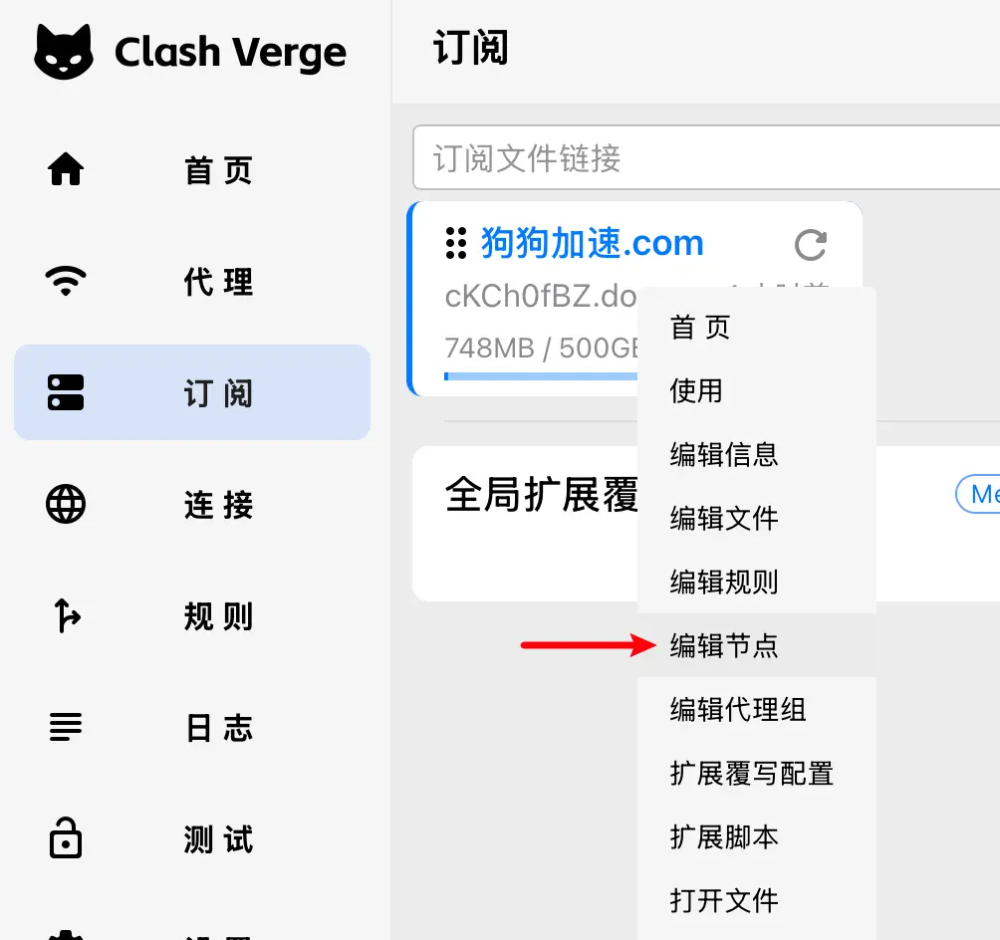
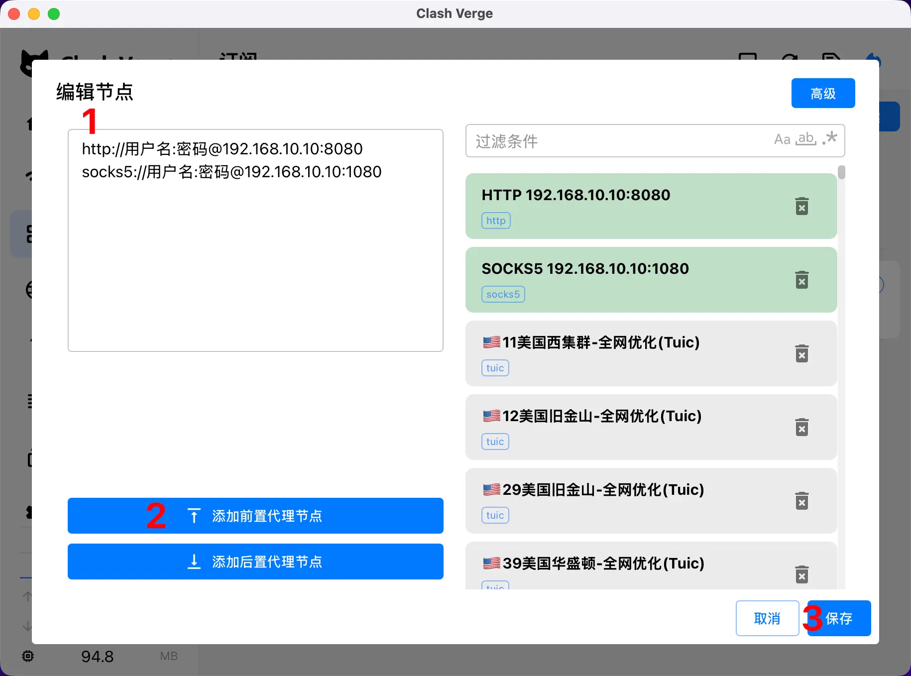

# Clash Verge 链式代理配置

> 链式代理（Proxy Chain）允许流量依次经过多个代理节点，常用于需要多层跳转的场景，如 机场节点 + 家庭宽带 组合。

<!-- prettier-ignore -->
!!! warning "版本要求"
    文档所述功能需要 Clash Verge Rev **v2.4.5** 或更高版本才可使用。

## 配置步骤

### 1. 编辑节点

<!-- prettier-ignore -->
!!! info
    此处编辑的节点**不会**随着订阅更新而失效，可以安全保存自定义配置。

右键点击订阅配置文件，选择 **"编辑节点"**。



### 2. 添加代理节点



在链式代理场景中，通常需要添加入口节点。节点支持多种 URI 格式：

#### HTTP/SOCKS 代理格式

```
http://用户名:密码@192.168.10.10:8080
socks5://用户名:密码@192.168.10.10:1080
```

#### 无需认证的代理

```
http://192.168.10.10:8080
socks5://192.168.10.10:1080
```

#### 其他支持的节点类型

链式代理支持所有 Mihomo 内核支持的节点 URI 格式，包括但不限于：

- `ss://` - Shadowsocks
- `vmess://` - VMess
- `trojan://` - Trojan
- `hysteria://` - Hysteria
- `hysteria2://` - Hysteria2

### 3. 配置代理链

按顺序点击节点名称，将其加入代理链：


- **入口节点**（最上面）：流量首先经过的节点
- **中间节点**（可选）：流量中转的节点
- **出口节点**（最下面）：流量最后经过的节点

#### 代理链流量路径示意

```
用户设备 → 入口节点 → 中间节点(可选) → 出口节点 → 目标网站
```

<!-- prettier-ignore -->
!!! tip
    链式代理通过 Mihomo 内核的 `dialer-proxy` 功能实现，可以灵活组合多个节点。


## 常见使用场景

### 机场节点 + 家庭宽带

最常见的链式代理场景，适合希望通过家宽出口访问特定服务的用户：

```
本地设备 → 机场节点(入口) → 家庭宽带代理(出口) → 目标网站
```

**使用场景：**
- 访问仅限特定 IP 的服务（如公司 VPN、家庭 NAS）
- 使用家庭宽带固定 IP 访问需要白名单的网站
- 通过机场加密流量后再用家宽出口

**配置示例：**
1. 添加家庭宽带节点：`http://192.168.1.100:8080` 或 `socks5://用户名:密码@home.example.com:1080`
2. 将机场订阅中的节点设为入口（最上方）
3. 将家庭宽带节点设为出口（最下方）

### 多层跳转

需要更高隐私保护或绕过特定限制时使用：

```
本地设备 → 节点A → 节点B → 节点C → 目标网站
```

## 注意事项

1. **延迟增加** - 链式代理会累加每个节点的延迟，建议选择低延迟节点
2. **速度影响** - 最终速度取决于链条中最慢的节点
3. **稳定性** - 任何一个节点失效都会导致整个代理链失效
4. **节点顺序** - 确保节点顺序符合预期，入口在上、出口在下
5. **认证信息** - 使用用户名密码认证时注意特殊字符需要 URL 编码

## 故障排查

### 代理链无法连接

1. 检查每个节点是否单独可用
2. 确认节点 URI 格式正确
3. 验证入口节点网络可达性
4. 查看日志获取详细错误信息

### 速度很慢

1. 检查各节点的延迟和带宽
2. 尝试减少链条中的节点数量
3. 选择地理位置更近的节点组合

## 更多信息

更多关于 `dialer-proxy` 功能和高级配置请参考：[Clash Meta dialer-proxy 文档](https://wiki.metacubex.one/config/proxies/dialer-proxy/)