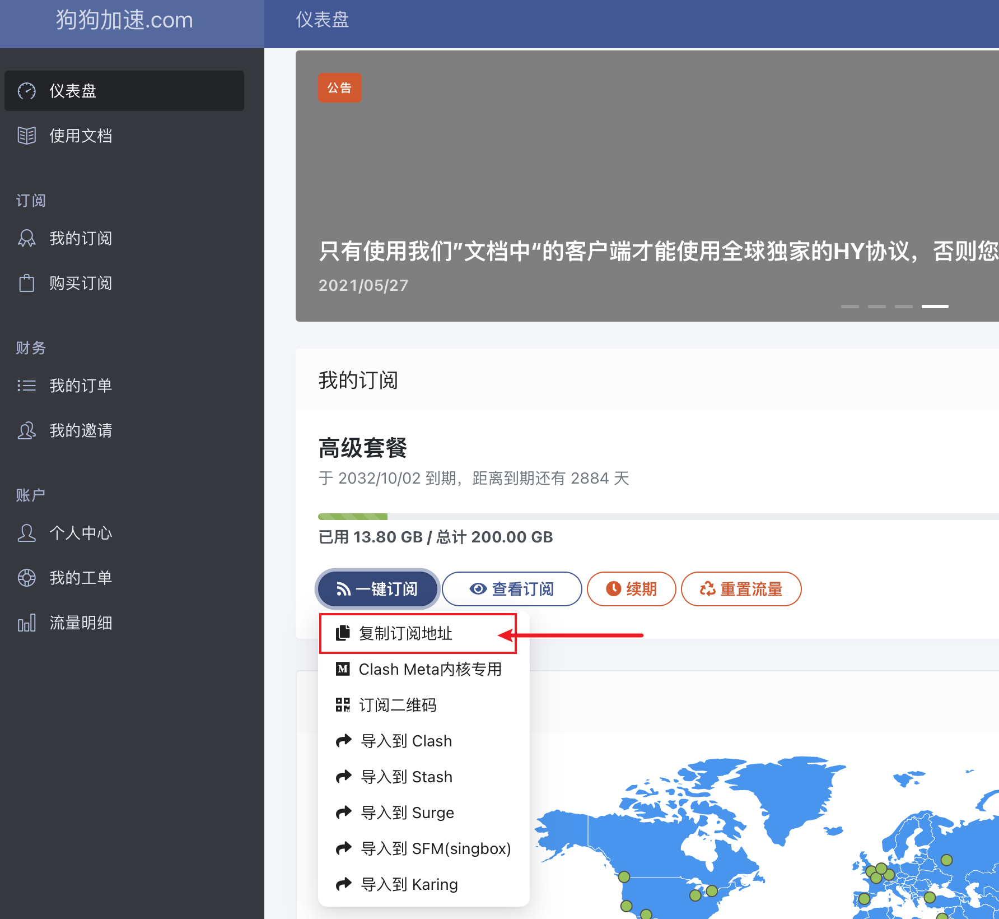
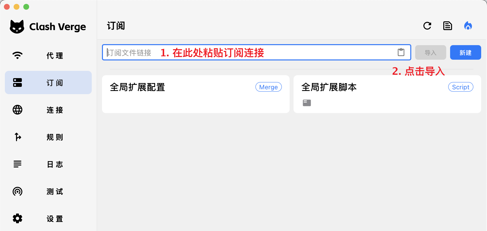
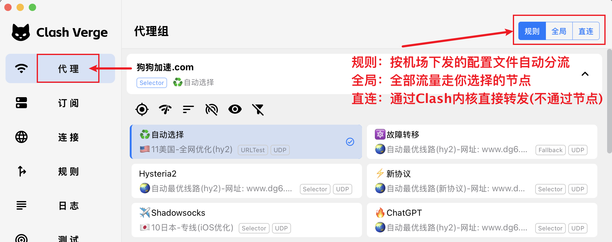
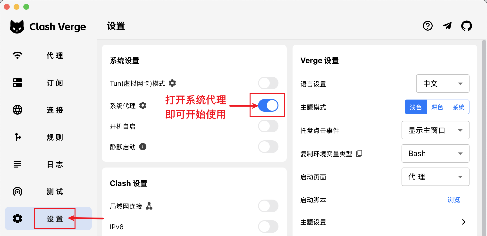

## 下载与安装

参见 [下载与安装](../install.md)

## 导入订阅

通过机场或者自建订阅导入节点和配置文件，以下以"[狗狗加速](https://vergepromot.dginv.click/#/register?code=Lo3NuUK1)"订阅演示：

## 选择节点和模式

## 打开代理(或开启 Tun 模式)

> **系统代理**：（原理：通过上方开关自动修改操作系统的代理设置）能处理大部分通过浏览器的科学上网需求。

> **Tun 模式**：在系统中安装虚拟网卡，以接管不支持“系统代理”的程序（例如游戏和命令行）。
