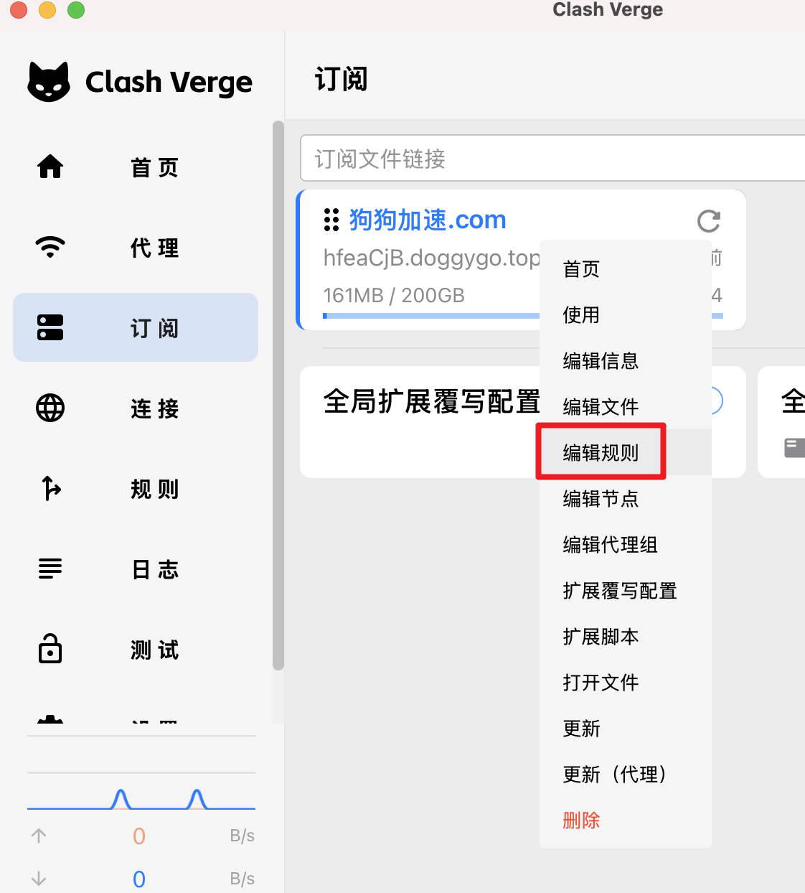
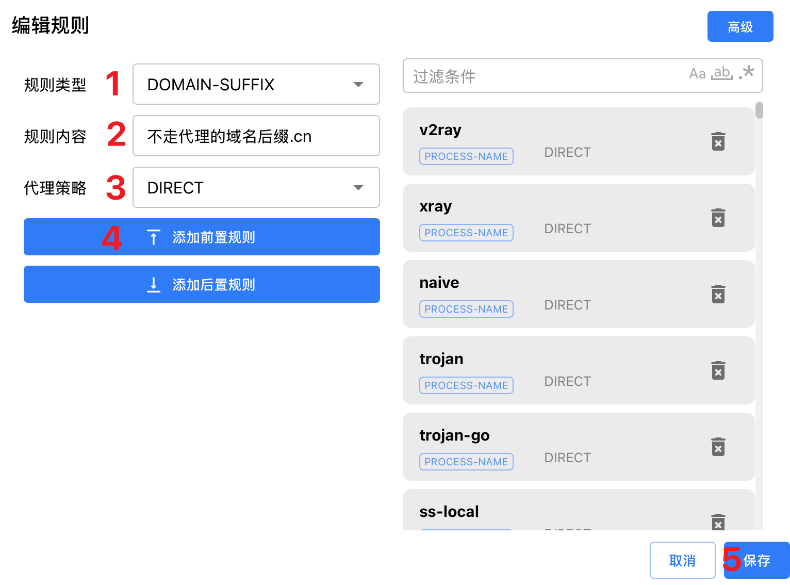

# Clash Verge 自定义规则配置

> 自定义规则可以精确控制流量分流，实现特定网站或应用的直连、代理或阻断。

## 配置步骤

### 1. 编辑订阅规则（注意此处编辑的规则**不会**随着订阅更新而失效）

右键点击订阅配置文件，选择 **"编辑规则"**。



### 2. 添加规则



### 3. 规则类型说明

规则从上到下依次匹配，匹配到第一条符合条件的规则后停止。

#### 域名规则

**DOMAIN** - 完整域名匹配
```yaml
- DOMAIN,google.com,代理策略
- DOMAIN,baidu.com,DIRECT
```

**DOMAIN-SUFFIX** - 域名后缀匹配
```yaml
- DOMAIN-SUFFIX,google.com,代理策略  # 匹配 *.google.com
- DOMAIN-SUFFIX,cn,DIRECT           # 匹配所有 .cn 域名
```

**DOMAIN-KEYWORD** - 域名关键词匹配
```yaml
- DOMAIN-KEYWORD,google,代理策略     # 匹配包含 google 的域名
- DOMAIN-KEYWORD,ads,REJECT         # 阻断包含 ads 的域名
```

**GEOSITE** - 地理站点匹配
```yaml
- GEOSITE,youtube,代理策略           # YouTube 相关域名
- GEOSITE,cn,DIRECT                 # 中国大陆网站
- GEOSITE,category-ads-all,REJECT   # 广告域名
```

#### IP 规则

**IP-CIDR** - IP 地址段匹配
```yaml
- IP-CIDR,192.168.0.0/16,DIRECT     # 局域网直连
- IP-CIDR,10.0.0.0/8,DIRECT         # 私有网络
```

**GEOIP** - 地理 IP 匹配
```yaml
- GEOIP,CN,DIRECT                   # 中国 IP 直连
- GEOIP,US,代理策略                  # 美国 IP 走代理
```

#### 端口规则

**DST-PORT** - 目标端口匹配
```yaml
- DST-PORT,22,DIRECT                # SSH 端口直连
- DST-PORT,80/443,代理策略           # HTTP/HTTPS 端口
```

#### 应用规则

**PROCESS-NAME** - 进程名匹配
```yaml
- PROCESS-NAME,Telegram.exe,代理策略  # Telegram 走代理
- PROCESS-NAME,WeChat.exe,DIRECT     # 微信直连
```

#### 逻辑规则

**AND** - 多条件同时满足
```yaml
- AND,((DOMAIN-SUFFIX,youtube.com),(GEOIP,!CN)),代理策略
```

**OR** - 多条件满足其一
```yaml
- OR,((DOMAIN-KEYWORD,google),(DOMAIN-KEYWORD,youtube)),代理策略
```

#### 通用规则

**MATCH** - 兜底规则（必须放在最后）
```yaml
- MATCH,代理策略                     # 其他所有流量的默认策略
```

### 4. 代理策略选择

在规则中指定的 **"代理策略"** 需要选择您配置的节点分组：

- `DIRECT` - 直连，不使用代理
- `REJECT` - 阻断连接
- `代理组名称` - 如 `🚀 手动切换`、`🎯 全球直连` 等

### 5. 规则插入位置

规则可以插入到 **"前置规则"** 或 **"后置规则"**：

- **前置规则**：优先级最高，建议将自定义规则放在此处
- **后置规则**：在订阅规则之后生效

**推荐使用前置规则**，因为规则按从上到下的顺序匹配，前置规则能确保您的自定义配置优先生效。

## 常用配置示例

### 广告屏蔽
```yaml
- GEOSITE,category-ads-all,REJECT
- DOMAIN-KEYWORD,ads,REJECT
- DOMAIN-KEYWORD,tracker,REJECT
```

### 国内网站直连
```yaml
- GEOSITE,cn,DIRECT
- GEOIP,CN,DIRECT
- DOMAIN-SUFFIX,cn,DIRECT
```

### 流媒体分流
```yaml
- GEOSITE,netflix,🎬 流媒体
- GEOSITE,youtube,📹 YouTube
- GEOSITE,disney,🏰 Disney+
```

### 应用分流
```yaml
- PROCESS-NAME,Telegram.exe,📱 Telegram
- PROCESS-NAME,steam.exe,🎮 游戏加速
- PROCESS-NAME,WeChat.exe,DIRECT
```

## 注意事项

1. **规则顺序很重要** - 规则按从上到下匹配，越靠前优先级越高
2. **测试规则效果** - 配置后建议测试访问对应网站确认规则生效
3. **定期更新规则** - 网站域名可能变化，需要适时调整规则
4. **避免规则冲突** - 确保规则逻辑清晰，避免前后矛盾

## 更多信息

更多规则语法和高级用法请参考：[Clash Meta 规则文档](https://wiki.metacubex.one/config/rules/)