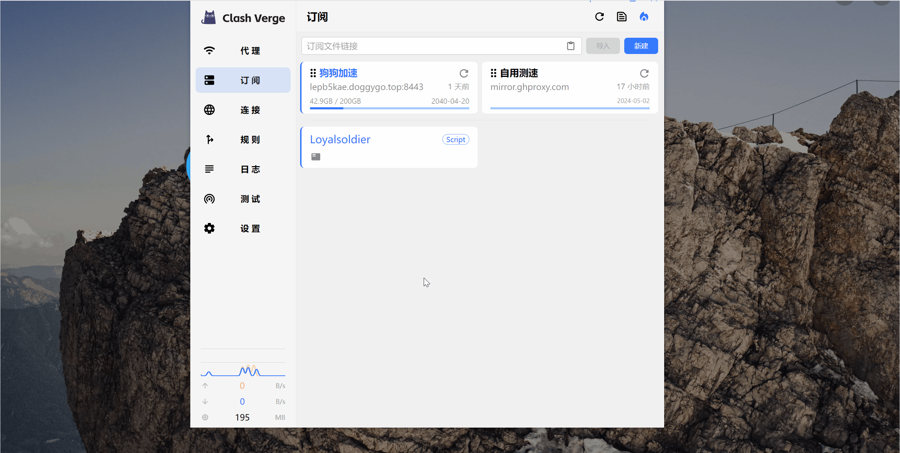

## 导入配置

### 请求格式

- 支持使用 `URL Schemes` 快速导入配置文件,该方式等价于访问如下地址。
- 如果请求有额外的参数，如 `&flag=meta` ，请一并使用 URI 编码后添加到 `url` 参数中。

```
clash://install-config?url=<URI编码后url>
```

### 功能失效解决办法

如果无法正常使用该功能，可能是由于使用其他 Clash 代理软件（如 CFW）卸载不完全。请检查下列注册表项指向的 exe 路径是否正确。

```
HKEY_CLASSES_ROOT\clash\shell\open\command
```

或者将下列配置保存为 `.reg` 文件，手动将配置添加进注册表（以管理员身份运行）。便携版请自行修改配置中的路径。

```ini
Windows Registry Editor Version 5.00

[HKEY_CLASSES_ROOT\clash]
"URL Protocol"=""
@="URL:clash"

[HKEY_CLASSES_ROOT\clash\DefaultIcon]
@="C:\\Program Files\\Clash Verge\\Clash Verge.exe"

[HKEY_CLASSES_ROOT\clash\shell]

[HKEY_CLASSES_ROOT\clash\shell\open]

[HKEY_CLASSES_ROOT\clash\shell\open\command]
@="\"C:\\Program Files\\Clash Verge\\Clash Verge.exe\" \"%1\""

```

## 订阅响应头

### content-disposition

如果响应头中存在 `content-disposition` 字段，则使用 `filename` 对应的值作为配置文件名。

```yaml
content-disposition: attachment; filename="test.yaml"
```

如果含有中文，则需要使用使用 `UTF-8` 编码。

```yaml
content-disposition: attachment;filename*=UTF-8''%E6%B5%8B%E8%AF%95%E8%AE%A2%E9%98%85
```

### profile-update-interval

如果响应头中存在 `profile-update-interval` 字段，则配置文件的 `更新间隔` 将被设置为对应的值（单位: 小时）。

```yaml
profile-update-interval: 24
```

### subscription-userinfo

如果响应头中存在 `subscription-userinfo` 字段，则其对应的流量信息(单位: 字节)、到期信息(时间戳)会显示在订阅卡片上。

```yaml
subscription-userinfo: upload=1234; download=2234; total=1024000; expire=2218532293
```

### profile-web-page-url

如果响应头中存在 `profile-web-page-url` 字段，则右键订阅卡片将会显示 `首页` 按钮。

```yaml
profile-web-page-url: https://example.com
```

<!-- prettier-ignore -->
!!! info
    - 一般要求请求的 `UA` 中含有 `clash` 字样才会返回该响应头。
    - 此功能要求Clash Verge Rev版本至少为 `v1.6.0`。


