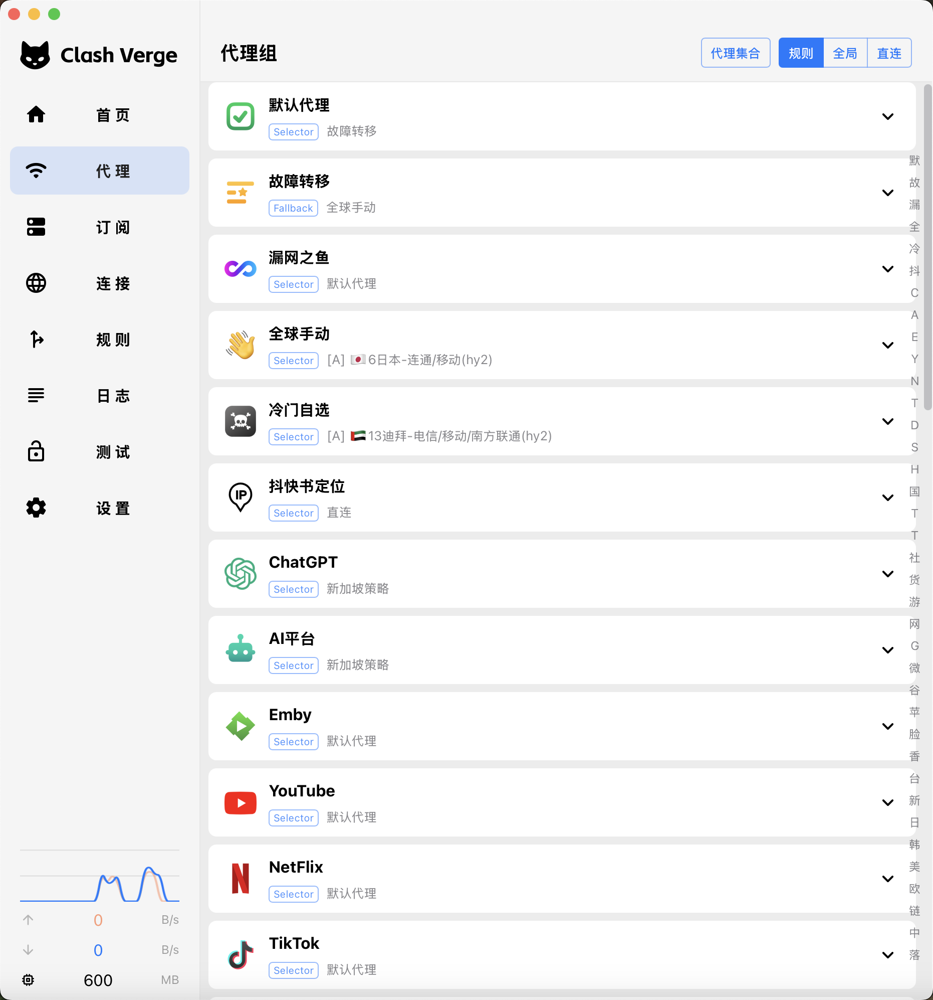

<h1 align="center">
  
   
  <a href="https://github.com/zzzgydi/clash-verge" target="_blank">Clash Verge</a> 的延续
   
</h1>
<h3 align="center">基于 <a href="https://github.com/tauri-apps/tauri" target="_blank">Tauri</a> 的 Mihomo GUI</h3>
<a href="https://t.me/clash_verge_rev" target="_blank">
Telegram 群组:@clash_verge_rev
</a>

## 特性

- 内置[Clash.Meta(mihomo)](https://github.com/MetaCubeX/mihomo)内核，并支持切换 `Alpha` 版本内核。
- 简洁美观的用户界面，支持自定义主题颜色、代理组/托盘图标以及 `CSS Injection`。
- 配置文件管理和增强（Merge 和 Script），配置文件语法提示。
- 系统代理和守卫、`TUN(虚拟网卡)` 模式。
- 可视化节点和规则编辑
- WebDav 配置备份和同步

## 预览

| 深色                               | 浅色                                |
| ---------------------------------- | ----------------------------------- |
|  |  |

## Promotion

### ✈️ [狗狗加速 —— 技术流机场 Doggygo VPN](https://vergedoc.dginv.click/#/register?code=oaxsAGo6)

🚀 高性能海外技术流机场，支持免费试用与优惠套餐，全面解锁流媒体及 AI 服务，全球首家采用 **QUIC 协议**。

🎁 使用 **Clash Verge 专属邀请链接** 注册即送 **3 天免费试用**，每日 **1GB 流量**：👉 [点此注册](https://vergedoc.dginv.click/#/register?code=oaxsAGo6)

#### **核心优势：**

- 📱 自研 iOS 客户端（业内"唯一"）技术经得起考验，极大**持续研发**投入
- 🧑‍💻 **12小时真人客服**(顺带解决 Clash Verge 使用问题)
- 💰 优惠套餐每月**仅需 21 元，160G 流量，年付 8 折**
- 🌍 海外团队，无跑路风险，高达 50% 返佣
- ⚙️ **集群负载均衡**设计，**负载监控和随时扩容**，高速专线(兼容老客户端)，极低延迟，无视晚高峰，4K 秒开
- ⚡ 全球首家**Quic 协议机场**，现已上线更快的 Tuic 协议(Clash Verge 客户端最佳搭配)
- 🎬 解锁**流媒体及 主流 AI**

### 🤖 [GPTKefu —— 与 Crisp 深度整合的 AI 智能客服平台](https://gptkefu.com)

- 🧠 深度理解完整对话上下文 + 图片识别，自动给出专业、精准的回复，告别机械式客服。
- ♾️ **不限回答数量**，无额度焦虑，区别于其他按条计费的 AI 客服产品。
- 💬 售前咨询、售后服务、复杂问题解答，全场景轻松覆盖，真实用户案例已验证效果。
- ⚡ 3 分钟极速接入，零门槛上手，即刻提升客服效率与客户满意度。
- 🎁 高级套餐免费试用 14 天，先体验后付费：👉 [立即试用](https://gptkefu.com)
- 📢 智能客服 TG 频道：[@crisp_ai](https://t.me/crisp_ai)
  
## 赞助

<iframe src="https://github.com/sponsors/clash-verge-rev/card" title="Sponsor clash-verge-rev" height="100" width="600" style="border: 0;"></iframe>

## 致谢

Clash Verge rev 项目基于/借鉴如下项目:

| 项目地址                                                              | 项目简介                                                                         |
| --------------------------------------------------------------------- | -------------------------------------------------------------------------------- |
| [clash-verge](https://github.com/zzzgydi/clash-verge)                 | A Clash GUI based on tauri. Supports Windows, macOS and Linux.                   |
| [Clash.Meta(mihomo)](https://github.com/MetaCubeX/mihomo)             | A rule-based tunnel in Go.                                                       |
| [Clash for Windows](https://github.com/Fndroid/clash_for_windows_pkg) | A Windows/macOS GUI based on Clash.                                              |
| [Tauri](https://github.com/tauri-apps/tauri)                          | Build smaller, faster, and more secure desktop applications with a web frontend. |
| [React](https://github.com/facebook/react)                            | The library for web and native user interfaces.                                  |
| [MUI](https://github.com/mui/material-ui)                             | Ready-to-use foundational React components, free forever.                        |
| [Vite](https://github.com/vitejs/vite)                                | Next generation frontend tooling. It's fast!                                     |

## License

GPL-3.0 License. See [License here](https://github.com/clash-verge-rev/clash-verge-rev/blob/main/LICENSE) for details.
