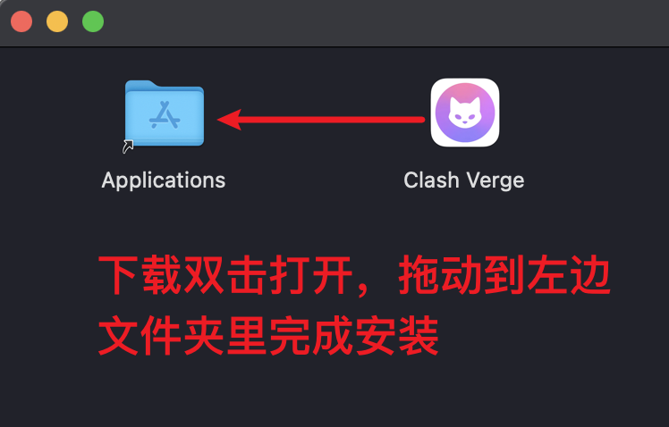

## 操作系统

=== ":material-microsoft-windows: Windows"

    <!-- prettier-ignore -->
    !!! warning
        - 如果你不清楚你的电脑系统架构，请下载 `x64` 架构文件（目前多数 Windows 电脑使用该架构）。
        - 2.0版开始，首次启动软件会自动尝试卸载和安装服务(uninstall-service和install-service)，必须同意安装，否则无法正常运行Mihomo内核。
        - **Windows 7** 用户请先升级至Win10/11，或改为使用Linux桌面发行版，现版本已经不再支持Windows7。
        - 带有 `fix_webview2` 字样的安装包为内置 `Webview2` 环境版本（该文件体积比普通安装包大，仅用于当系统缺少且[无法安装WebView2](./faq/windows.md#webview2)环境时使用，当你无法正常打开面板也可以试试这个版本）。
        - 目前不会推出Portable便携版，如有需要请自行下载代码构建。
    
    | 系统架构 | 下载地址 |
    | -------- | -------- |
    | x64 | <list class="download-list"><item logo="windows" label="安装包" content="x64" keyword="x64-setup.exe" color="0078D7">加载中...</item><item logo="microsoftedge"label="内置 Webview2 安装包" content="x64" keyword="x64_fixed_webview2-setup.exe" color="4CCE66"><item></list> |
    | x86 | <list class="download-list"><item logo="windows" label="安装包" content="x86" keyword="x86-setup.exe" color="539CDE">加载中...</item><item logo="microsoftedge"label="内置 Webview2 安装包" content="x86" keyword="x86_fixed_webview2-setup.exe" color="75DB87"><item></list> |
    | arm64 | <list class="download-list"><item logo="windows" label="安装包" content="arm64" keyword="arm64-setup.exe" color="8BB2E5">加载中...</item><item logo="microsoftedge"label="内置 Webview2 安装包" content="arm64" keyword="arm64_fixed_webview2-setup.exe" color="A4E4AD"><item></list> |

=== ":material-linux: Linux"

    === ":material-debian: Debian/Ubuntu/Deepin"
    
        <!-- prettier-ignore -->
        !!! warning
            Ubuntu `24.04` 需要安装额外依赖，详见[常见问题](./faq/linux.md)。
    
        | 系统架构 | 下载地址 |
        | -------- | --------------------------------------------------------------------------------------------------------------------------------------- |
        | x64      | <list class="download-list"><item logo="debian" label="安装包" content="x64" keyword="amd64.deb" color="A80030">加载中...</item></list>   |
        | x86      | <list class="download-list"><item logo="debian" label="安装包" content="x86" keyword="i386.deb" color="C02B4A">加载中...</item></list>    |
        | arm64    | <list class="download-list"><item logo="debian" label="安装包" content="arm64" keyword="arm64.deb" color="D44E64">加载中...</item></list> |
        | armv7    | <list class="download-list"><item logo="debian" label="安装包" content="armv7" keyword="armhf.deb" color="E9717E">加载中...</item></list> |
    
        下载上方deb包后，使用apt安装：
        ```
        sudo apt install -y ./Clash.Verge_x.x.x-_xxx.deb
        ```
    
    === ":material-redhat: CentOS/Fedora/SUSE"
    
        | 系统架构 | 下载地址 |
        | -------- | ----------------------------------------------------------------------------------------------------------------------------------------- |
        | x64      | <list class="download-list"><item logo="redhat" label="安装包" content="x64" keyword="x86_64.rpm" color="CC0000">加载中...</item></list>    |
        | x86      | <list class="download-list"><item logo="redhat" label="安装包" content="x86" keyword="i386.rpm" color="E63434">加载中...</item></list>      |
        | arm64    | <list class="download-list"><item logo="redhat" label="安装包" content="arm64" keyword="aarch64.rpm" color="F14D4D">加载中...</item></list> |
        | armv7    | <list class="download-list"><item logo="redhat" label="安装包" content="armv7" keyword="armhfp.rpm" color="FF6868">加载中...</item></list>  |
    
        下载上方rpm包后，使用dnf/yum安装：
        ```
        sudo dnf install ./Clash.Verge_x.x.x-_xxx.rpm
        sudo yum localinstall ./Clash.Verge_x.x.x-_xxx.rpm
        ```
    
    === ":material-arch: Arch Linux/Manjaro/SteamOS"
        !!! warning
            不建议在 Manjaro、SteamOS 等 Arch 衍生发行版上使用 `[archlinuxcn]` 仓库。

        === "archlinuxcn"
            1.  添加 `[archlinuxcn]` 仓库。

                1.1.  在 `/etc/pacman.conf` 文件中写入下列内容。
    
                ```
                [archlinuxcn]
                Server = https://mirrors.ustc.edu.cn/archlinuxcn/$arch
                Server = https://mirrors.tuna.tsinghua.edu.cn/archlinuxcn/$arch
                Server = https://mirrors.hit.edu.cn/archlinuxcn/$arch
                Server = https://repo.huaweicloud.com/archlinuxcn/$arch
                ```
    
                1.2. 在终端运行下列命令。
    
                ```bash
                sudo pacman -S archlinuxcn-keyring
                ```
    
            2.  安装 `clash-verge-rev`。
    
            ```bash
            sudo pacman -S clash-verge-rev
            ```

        === "AUR"
            ```bash
            paru -S clash-verge-rev-bin # 适用于 paru
            yay -S clash-verge-rev-bin # 适用于 yay
            yay -S clash-verge-rev-alpha-bin # 也可以安装 Alpha 版
            paru -S clash-verge-rev-alpha-bin # 适用于 paru
            ```

=== ":material-apple: macOS"

    <!-- prettier-ignore -->
    !!! warning
        不支持 `macos` 10 操作系统，请升级 `macos` 到 11 或 更高版本。
    
    | 系统架构 | 下载地址 |
    | ------- | ------ |
    | Intel 芯片 | <list class="download-list"><item logo="apple" label="安装包" content="x64" keyword="x64.dmg" color="A8A8A8">加载中...</item></list> |
    | Apple M 芯片 | <list class="download-list"><item logo="apple" label="安装包" content="aarch64" keyword="aarch64.dmg" color="C4C4C4">加载中...</item></list> |
    
    

## 源代码编译安装

编译构建指南请转到[构建](https://github.com/clash-verge-rev/clash-verge-rev/blob/main/CONTRIBUTING.md)。

**请注意区分以下文件清单**(以用户量比较多的Windows为例)

```shell
+--- resources 						#资源目录
  +--- locales 						#语言包
  \--- clash-verge-service.exe  	#服务模式主程序
  \--- Country.mmdb
  \--- enableLoopback.exe			#解除UWP应用网络回环限制工具
  \--- geoip.dat
  \--- geosite.dat
  \--- install-service.exe			#服务模式安装程序
  \--- sysproxy.exe					#系统代理程序
  \--- uninstall-service.exe		#服务模式卸载程序
\--- clash-verge.exe				#主程序
\--- verge-mihomo.exe				#Mihomo核心程序
\--- verge-mihomo-alpha.exe			#Mihomo Alpha 版本
```

## 安装问题

如果安装/使用过程中遇到了问题，请参考文档中的[常见问题](./faq/windows.md)。

## 发布地址

> Clash Verge Rev 目前仅通过 GitHub Release 发布，请注意辨别。

| 发行版本                  | 下载次数                                                                                                          | 下载地址                                                                                                                                                                                | 备注                                 |
| ------------------------- | ----------------------------------------------------------------------------------------------------------------- | --------------------------------------------------------------------------------------------------------------------------------------------------------------------------------------- | ------------------------------------ |
| Github Release **正式版** |     | <a href='https://github.com/clash-verge-rev/clash-verge-rev/releases/latest' target="_blank"></a>    |                                      |
| Github Release **测试版** |  | <a href='https://github.com/clash-verge-rev/clash-verge-rev/releases/tag/alpha' target="_blank"></a> |  |

<script>
const fileList = [];
const divList = document.querySelectorAll("list item");
const githubLink = "https://github.com/clash-verge-rev/clash-verge-rev/releases";
(async () => {
  const link = "https://api.github.com/repos/clash-verge-rev/clash-verge-rev/releases/latest";
  const { assets } = await fetch(link).then((r) => r.json());
  for (const { name, browser_download_url: url } of assets) {
    fileList.push({ name, url });
  }
  for (const div of divList) {
    const logo = div.getAttribute("logo");
    const label = div.getAttribute("label");
    const keyword = div.getAttribute("keyword");
    const content = div.getAttribute("content");
    const color = div.getAttribute("color") ?? "44CC11";
    div.innerHTML = fileList.map(({ name, url }) => {
      if (name.endsWith(keyword)) {
        const a = document.createElement("a");
        a.href = url;
        const img = document.createElement("img");
        img.src = `https://img.shields.io/badge/${label}-${content}-${color}?logo=${logo}`;
        a.appendChild(img);
        return a.outerHTML;
      }
      return "";
    }).join("");
  }
})();
</script>
<style>
list{
  display: flex;
  gap: 8px;
}
</style>
