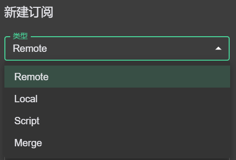

# 使用指南

## Profiles Enhanced Mode 增强模式

目前支持 4 种类型的配置文件，分别是 `Remote`、`Local`、`Script`、`Merge`。其中，`Remote` 和 `Local` 类型为 **主配置文件**，`Script` 和 `Merge` 类型为 **增强配置文件**，用于修改主配置文件的。点 `新建` 可以创建这些配置文件（如下图），对于 `Remote` 类型的，也可以直接输入 URL 后导入即可。 （备注：该模式主要参考了 CFW 的实现）



### Remote 远程配置

目前仅支持 clash 格式的配置链接，即响应体数据是符合 clash 配置格式的（utf8 编码）。如果响应头中存在 `Subscription-Userinfo` 字段，则其对应的流量信息会展示出来。远程配置可以点击右上角的更新按键自动更新。

### Local 本地配置

新建本地配置之后，`右键 - 打开文件` 即可打开对应的本地配置文件（默认会用 VScode 打开，如果找不到执行程序则用默认编辑器打开）。在编写完本地配置之后`右键 - 使用` 即可刷新该配置。

### Merge 合并处理

该配置类型用于对主配置进行字段增加的操作，文件格式是 ·yaml·。该 idea 源于 CFW 配置预处理中的简便方法。目前仅支持 6 种操作类型。启用方法：`右键 - 启用`，在修改了文件之后，点击刷新触发配置变更。

- prepend-rules：类型和 `clash rules` 配置一致，内容合并到 rules 前
- append-rules：类型和 `clash rules` 配置一致，内容合并到 rules 后
- prepend-proxies：类型和 `clash proxies` 配置一致，内容合并到 proxies 前
- append-proxies：类型和 `clash proxies` 配置一致，内容合并到 proxies 后
- prepend-proxy-groups：类型和 `clash proxy-groups` 配置一致，内容合并到 proxy-groups 前
- append-proxy-groups：类型和 `clash proxy-groups` 配置一致，内容合并到 proxy-groups 后
- 其他 clash 的字段：5 个默认使用的字段(`rules`, `proxies`, `proxy-groups`, `proxy-providers`, `rule-providers`)以及其他 clash-meta 支持的字段，直接设置这些字段将直接覆盖 profile 对应字段的内容。

> 注意：需要使用其他字段时，例如 dns,tun 等，需要在设置页 - Clash Field(Clash 字段)里勾选对应的字段，不勾选的字段将被忽略。

### Script 脚本处理

该配置类型提供编写 JS 脚本修改配置的能力，JS 运行时为 `quickjs`。该 idea 源于 CFW 配置预处理中的 Mixin/parser。启用方法：`右键 - 启用`，在修改了文件之后，点击刷新重置配置文件。

脚本中需要声明一个 main 函数，函数签名为 `main(params: object): object;`。函数入参为序列化为 js object 的 clash 配置，务必返回处理后的 js object。

如果脚本中存在异常未处理，处理程序将跳过该脚本所做的操作，并且对应的 profile 项将变红和报错提示。

脚本执行环境采用 quickjs 实现，不能执行如文件系统访问等操作。

例如，处理 ws 配置变更：

```javascript
function main(config) {
  if (!config.proxies) return config;

  config.proxies.forEach((proxy) => {
    if (proxy.network === "ws" && (proxy["ws-path"] || proxy["ws-headers"])) {
      const opts = proxy["ws-opts"] || {};

      opts.path = proxy["ws-path"];
      opts.headers = proxy["ws-headers"];

      delete proxy["ws-path"];
      delete proxy["ws-headers"];
    }
  });

  return config;
}
```

### Profiles 的处理流程

首先选择一个主配置文件，如果没有就是默认的空配置。其次如果存在 `Script` 和 `Merge` 这些增强配置，且已经启用了，则会按顺序进行**链式处理**。即前一个处理的结果作为下一个处理的输入。
